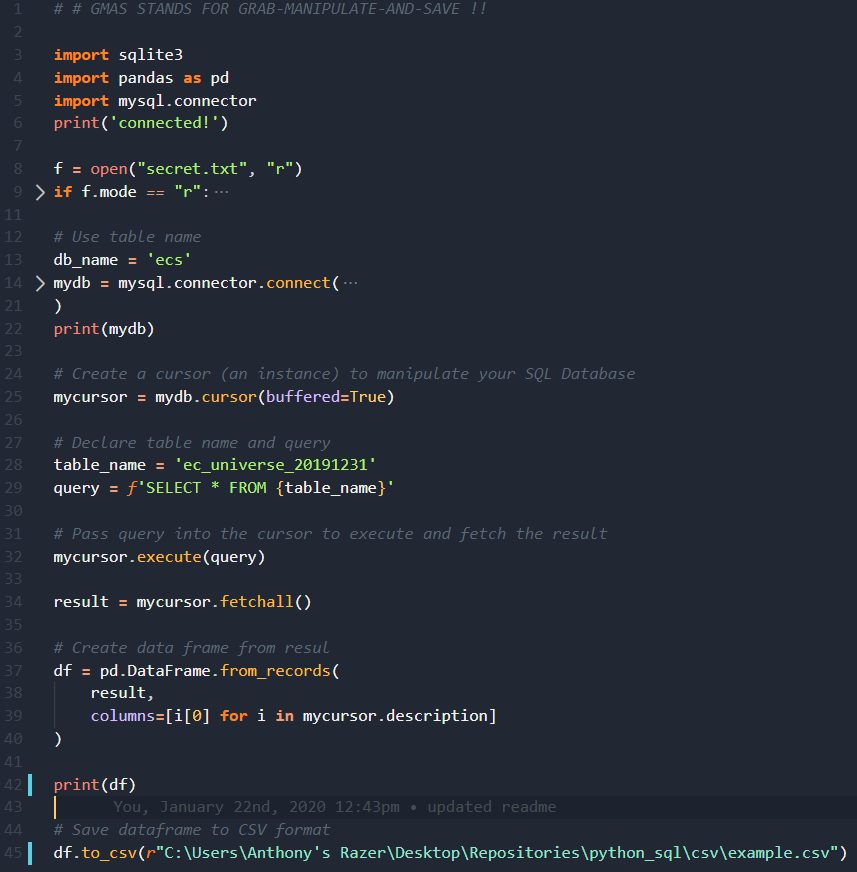

# Python and MySQL RDBMS Repo

Welcome! This repo contains basic CRUD functions along with some data manipulation tools to extract equity data from MySQL
using Python. This repo will be the central hub for learning how to manipulate equity data using code instead of cumbersome
MS Excel. 

The genesis behind this initiative was to re-invent data storage and visualization now that our enterprise has hit a key
personal milestone: **150 million data points!**

For a smaller buy-side RIA, this is a big deal! Our data spans 19 years and grows every month!

## Here's why I'm now using code!

* Humans are ill-equipped to quantify and model volumes of complex unstructured information into predictive insights
* As a consequence, decision makers miss valuable insights buried in the complexity and make their decisions on incomplete and biased analysis
* As it relates to our current SOP, 180mb excel files are hard/impossible to manipulate in memory along with multiple other desktop apps
* In order to grab only certain fields from a larger dataset, you HAVE to read into the entire sheet
    * (This is like 'SELECT * FROM foo' when you only want one field, it makes no sense to display all data if not desired)
* And speaking of that last point, you can't grab data without rendering it to the screen in Excel! Annoying!

TLDR: Most of the work we do involves grabbing a mass of data saved in some Excel file, pasting it into a seperate excel instance, manipulating it and saving it somewhere. This is incredibly RAM intensive and excel is prone to crashes. Excel is a necessary evil, and I'm over it.

### Why Python?

In my limited experience I've coded in JavaScript, C, HTML-CSS (both non-logical) and Python. All of these languages but one have a major drawback: to beginners the code looks like an alien language. Python is written in what looks like the english language. This means you can start creating faster!!!

Python has great statistical and visualization libraries and works well with any modern O/RDBMS, NoSQL or Non Relational DMBS.

## About EquityCompass & Our Data

At EquityCompass, our data enterprise houses as-of, as-reported equity market data that we aggregate monthly. We target coverage of the Russell 3000 and the S&P 500. Our data is updated as-of the last day of the month and includes obsolete securities going back to 2001. We currently aggregate data on 206 unique fields for each security, less eight fields which are identifiers.

Each month we exand our data by 3,100 securities x 206 fields = 638,600 data points.

Fields include price, 52wk hi and lo, valuation fields, relative strength fields, sector data, fundamental data, index membership data and LOTS of proprietary metrics. We currently do not publish our data publicly, nor do we have plans to sell our data via an API.

## About This Repo

Within the test_data folder, the file `gmas.py` is to become the most critical template of this initiative. GMAS (Pronounced: G-mass) stands for GRAB-MANIPULATE-AND-SAVE. These are the primary steps that our gata will go through once it's scrubbed and transitioned into MySQL.

### The GMAS:

The GMAS will be supported by the file `masterQuery.py` in the 'queries' folder within 'test_data.' This file has searchable key-words that will allow me to copy-pasta queries for certain files we create. The critera for sorting and filtering our data to create certian lists remains the same over time.